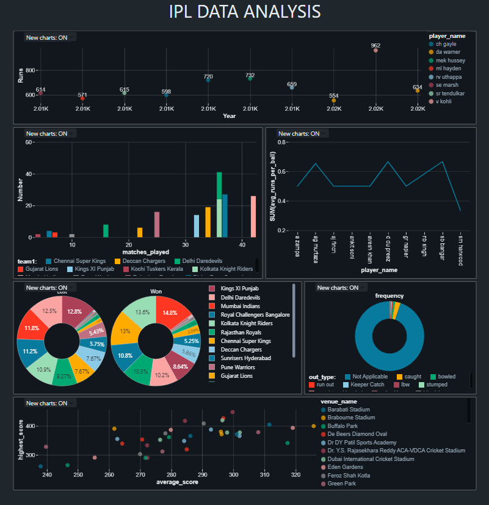

# Data Analysis using Databricks & PySpark

## Overview
This project demonstrates how to perform **data analysis** using **Databricks** and **PySpark**. It covers key steps including loading, transforming, and analyzing data stored in various file formats. This project leverages **Azure Databricks** and **Azure Storage Services** for distributed data processing and storage. Azure Databricks provides a collaborative environment for running PySpark workloads, while Azure Storage is used to store datasets like `ball_by_ball`, `match`, `player`, and other cricket-related data.

---
### Features of the Infrastructure:
1. **Azure Databricks**:
   - Collaborative environment for running PySpark.
   - High-performance data analysis with Spark clusters.
2. **Azure Storage Services**:
   - Datasets are securely stored in Azure Blob Storage.
   - Optimized for scalable and reliable data access.

   
## Features
1. **Data Loading**: Loading structured and semi-structured data (e.g., CSV, JSON, Parquet) into PySpark DataFrames.
2. **Data Transformation**:
   - Filtering, grouping, and aggregations.
   - Using SQL queries with `createOrReplaceTempView`.
3. **Data Analysis**:
   - Performing exploratory data analysis (EDA).
   - Deriving insights using window functions and advanced PySpark transformations.
4. **Data Integration**:
   - Joining multiple datasets (e.g., `ball_by_ball`, `match`, `player`, `team`).
5. **Visualizations**: Using Databricks' built-in visualization tools to create charts and graphs.

---

## Dataset Details
The project uses cricket-related datasets to perform analysis. Below are the key datasets used:
1. **Ball-by-Ball Dataset**:
   - Contains detailed ball-by-ball match data.
   - Key columns: `match_id`, `team_batting`, `runs_scored`, `wides`, `noballs`.

2. **Match Dataset**:
   - Includes metadata for cricket matches.
   - Key columns: `match_id`, `team1`, `team2`, `match_date`, `season_year`.

3. **Player Dataset**:
   - Player profile data.
   - Key columns: `player_id`, `player_name`, `batting_hand`, `bowling_skill`.

4. **Team Dataset**:
   - Contains team metadata.
   - Key columns: `team_id`, `team_name`.

5. **Player-Match Dataset**:
   - Links players to matches with additional performance details.
   - Key columns: `player_match_sk`, `match_id`, `player_id`, `is_manofthematch`.

---

## Installation

### Prerequisites
- **Databricks**: An active Databricks workspace.
- **Python**: Python 3.8 or above.
- **PySpark**: Installed in your Databricks cluster.

## Dashboard from Databricks

